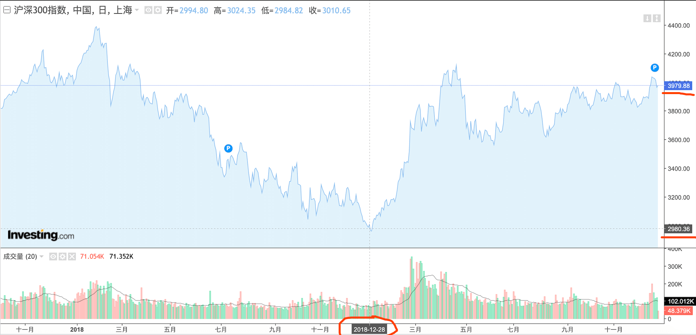
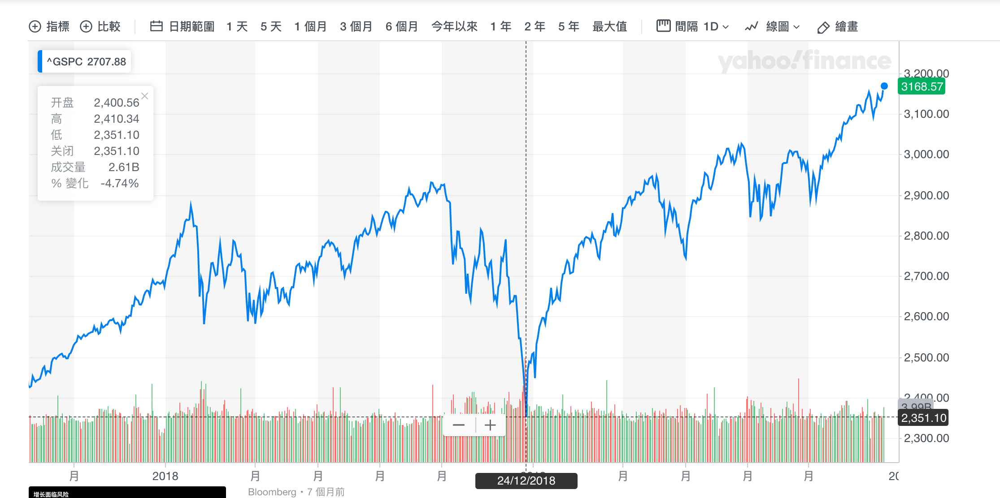
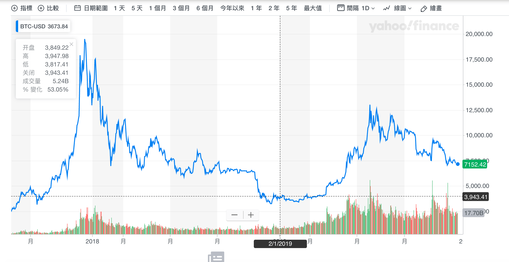
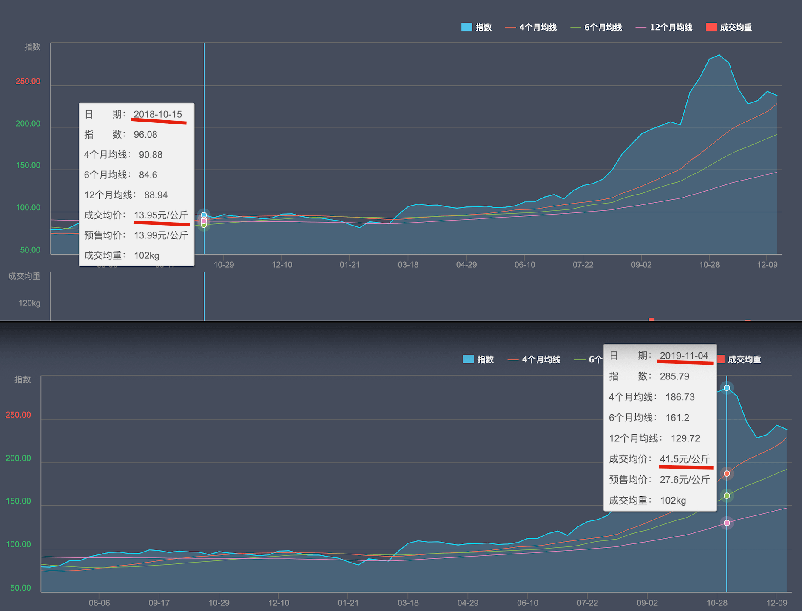

# 2019年总结

印象中的2018年刚结束，好像伴随着大家的情绪都跌倒了谷底。
周围人会时不时提醒你一下，现在做投资是不合适的；网上的专家长篇大论只为让你深刻地明白，经济周期已经走过顶峰，衰退正式启动。

就算最乐观的那批人，此时此刻拿得出手的建议也是显得极度保守 —— “你可以不悲观”

于是，一年过去了，如今我们真的有机会回头看了，才发现当初大家极度恐慌的时候还真的是“谷底” ……

沪深300 ↓↓↓

标普500 ↓↓↓

比特币 ↓↓↓

猪肉 …… ↓↓↓

值得注意的是，咱们把这几个图翻出来，可以看着乐一乐，也可以对比一下不同资产之间的差异，还可以用来想明白我们的感受实际上有多么不靠谱，但是我们没办法证明人们口中所说的经济衰退是不是变得不一样了，毕竟，**年这个单位对于某一个经济周期来说实在是太短了。**

最初我们听别人讨论经济下行的时候，我们多少有些沮丧，可后来呢，我们发现，其实也没啥大不了的吧，至少没有我们最初耳闻的时候所以为的自己会在相当长时间里为了它废寝忘食。

反而，我们都是相当“实事求是” —— 对于我们来说，无论这个世界打算变成什么样，我们都逃不开去处理生活中时不时就冒出来的糟心事。

而且，那糟心的事儿又未必仅仅发生在自己的身上。

掰掰手指数一数这一年的见闻 ……

> 这一年里，刘强东好像比马云出名多了 ……  
>
> 一月份的时候，记得有一只突如其来爆红的小佩奇；  
>
> 四月份的时候，有个哥们在 github 上创了一个 996icu 项目，随之而来的是一轮激烈 996 工作制讨论；  
>
> 六月份左右，听说华为被美封杀了；  
>
> 八月份的时候，很多人跟我一样，突然发现，鞋子不仅仅是可以穿的，还是可以炒的 ……  
>
> 又过了没多久，我们又反应过来了，养猪其实比买鞋子更靠谱 ……  
>
> 还有那几个月来从未消停过的香港问题；  

这是这一年里人们一起经历过的众多话题中的一小部分，随手竟然能够数出来不少。

突然间，就好像感受到了这个世界又被进一步推到了我们的跟前 —— 竟还有丝丝浪漫的味道。

可，真的是这样吗？

若是从另外一个角度考虑，完全可以得到一个惊悚的版本：**我们的注意力早已无处可逃。**

日常中，颇有成就的人总会告诉我们，我们的身边从来不缺少机会，可是，我想啊，看不到的机会应该算不上是我的机会吧。  
倒是，我们越来越不缺的是，有人会主动告诉我们什么是机会。他们会无时无刻，全方位，向你热心推荐，什么东西不能或缺，什么事儿非做不可，躲都躲不及，逃也逃不开 ……

在过去一年里，我几经尝试去思索知识这个东西，虽然始终得到的只不过是“凑合着用”的思考结果，但是总感觉比之前想明白了些，对于自己应该采取如何的行为也更清楚了些，而在这个过程中，有一个类比令我深深震撼，大意是：

> “所谓的知识爆炸，爆炸了的只不过是垃圾，真正有价值的知识从来都是一小部分”

当我还在欣喜于生活被各种新奇的东西所环绕的时候，有些人却早已看得更明白：垃圾正在拼命地炸开了花，污水正在玩命地往我们身上泼 ……

当然，如此表达有它夸张的地方，只不过，我们可能更加关注的点是别的：**就像垃圾与非垃圾是相对的，污水与干净的水也是相对的，进而，好知识与差知识其实也一样，因比较而生。**

> 若是用不着对比抉择，一切都是美好的，一切都是善良的，一切都无论如何总不至于非拒绝不可的 ……  

那么我们就进行比较吧，可我们很快又会尴尬地意识到，关于好知识与差知识的之间的界定，并没有我们一开始以为的那么显而易见，理所应当。  

比如，所谓的“有用”就是一种莫名其妙的感觉，一旦我们收获这种感觉，我们似乎就默认自己已经正确了，成长了，改变了，强大了。  

可如果简单考虑一下，就会发现，仅仅是感受上的“有用”其实没啥了不起。  
任何时刻，我们若是想给自己产生一点有用的感觉，也着实简单，对于那些在我们大脑里面从未有过的知识，我们的大脑就好像预先留着一个空位一样，于是呢，我们只要找点东西往那里一放，舒服了~  

现实中，我们只要打开微信就可以从各种公众号、群聊、朋友圈里面看到有所价值的信息；只要刷刷抖音，我们可以轻松掌握多种实用的生活小技巧；只要逛逛微博就可以捕获各种热点资讯。  
哪怕有一天，突然意识到自己在这些事儿上花费了太多时间了，我们也常常不由地如此宽慰自己：毕竟我还是学到了有用的东西 ……  

一直以来，“三人行必有我师”是个人们津津乐道的说法，在我看来，某种程度上，其实就是对这种现象更为朴素直观的描述 —— **无论是谁，都能够给我们“有用”的东西，无论什么事，都能够让我们从中有所收获，这才是真实世界的样子。**

> 换而言之，“有用”的东西从来不是我们所缺少的。

借用经济学上一个非常有意思的概念 —— “稀缺”，我的理解，稀少不够用的东西才越可能有大价值，反过来看，也似乎很大程度上是成立的，**每个人都唾手可得的东西往往价值没那么高。**

给问题找一个说得过去的答案，给现象找一个符合情理的解释，这样的事情，往往比我们想象的容易得多。  

若非经他人提醒，我很少有机会站在另外一个角度考虑：  
**只要是答案，只要是针对某个事儿的理解，就算它们低效劣质，也总是看起来有用得上的地方，或者“有总比没有的强”。**就好像，不懂学习的孩子照样能够从同样不懂学习的父母那里得到一些学习的方法与意义 ……  

可那真的是我们应该接受的答案，或者理解吗？  
因为近年来自己开始认真思考投资，于是有机会在这个事儿上想得更明白了。  
投资领域是最能够让人们感受到所谓的“乱象丛生”的地方，尤其是这两年才初步被人们接受的区块链投资领域。  
不同于其它领域，在这个领域里，信息总是被极度扭曲，“商业互黑”也是常态。

“专业”的黑子们有时会跑到某个项目方的聊天群里，找一些让人不舒服的话题让大家注意他，然后开始有人骂他，他又变得一本正经了，最后在别人的臭骂声中被踢出了群聊。  
于是，他的工作就完成了，跑到自己的文章里，楚楚可怜地摆出“证据”，告诉大家：“你们评评理吧，这种社区多么可怕，完全不给别人质疑的机会，如图，某网友仅仅客观地质疑了几句就被踢出了群聊”

起初我也挺纳闷，逻辑如此荒谬的文章真的有意义么？转念一想，他们写这样的垃圾文章，其实不是给有所知情的人看的，他们恰恰是写给那些对事情的真相毫无了解的人看的，面对那样的人，他们如何扭曲事实都是无所谓的。

就好像，我们时不时会接到一些很“傻逼”的骗子电话，可实际上，人家也考虑得挺明白，他们不是打给你的，他们是打给那些碰巧信了他们的话的人。

当然，从你的角度，你也应该当我的看法只是一面之词。

只不过，我想，在更为核心的考虑上，我们是可能达成一致的：

身处每个时代，都有它矛盾的地方，这是一个极度强调主观意愿，每个人兜里都揣着一个叫做“发言权”的东西的时代。  
> 于是，更多的时候其实是这样的，对于表达者来说，他们更像是“非表达不可”，以至于，“表达”这个事儿本身反而比起自己表达的东西是否足够客观，是否足够有价值，是否足够负责任还重要得多。  

到了四月份左右，无论是 A 股还是美股，都从半年前的低点涨回来了不少，于是有一票人跳出来了，摆出一副说教的姿势，“你看，之前我们就推荐买入，你们不听 …… ”

对于如此的言论，我早已不当回事，理由也挺简单：  
> 不管他们有意无意，那些仅仅拿着自己短期正确的判断，然后就想说服我为他们接下来的预测买单的人，对我来说，他们并不是好人~

还有进一步的考虑 ……

> 为了更加爱护自己，在足够重要的事儿上，如果可能的话，少听别人的胡说八道。

**在一个人人都可以表达，人人都倾向于表达的世界里，如何有效地“让别人闭嘴”呢？**我的思考结论是，尽量靠近更为优质的信息源。

于是呢，在这一年中，我把 Google + 英文检索给习惯了，直接的结果就是彻底摆脱了 \*\*\*\* 的（脏话请自行脑补）百度，进而，我就好像能够看到了一个更完整的中文世界以及部分的英文世界一般。

再比如，我花越来越少的时间在阅读自媒体文章上，取而代之，我尝试把越来越多的时间花在查找更专业的文档上，或者去阅读更完整的书籍

优质信息源的好处可能并不直观，但是劣质信息源的坏处总是更容易想明白：

> 劣质信息源就是最擅长在我们不经意之间把我们坑死，而且没有丝毫心慈手软 ……

我觉得这里有个需要注意的地方，虽然对于别人来说显而易见，但我确实是在今年里吃了大亏之后才开始重视它：所谓的“优质的信息源”，并不意味着它每个方面都是相对优质的，值得接收的。

比如，我们可以跟优秀的程序员前辈学技术，但是如果某一位程序员先生跟你谈人生，聊健康，那么你就要注意了。

虽说，程序员当中也有健康习惯良好的。只不过，我想，一旦我们如此考虑事儿 ……

> 我们真正想要追求的并非事实上绝对正确，而是概率上的更为靠谱。

……

写到这，你也发现了，这是一篇看起不太像年总结的年总结。  
事实上，它是我反复思考之后觉得最能够反映这一年的自己与之前的自己不同之处的主题，虽然它极度简单，也毫不优雅。

回头翻一翻这一年里记录下来的东西，我才发现，原来一年是那么长，感觉上值得拿出来讨论的东西其实有好多好多，尤其是那些似乎独特发生在自己身上的事儿，总觉得它们太重要了，因为它们让我有机会在不同于他人的维度上思索与成长。

我猜你也是一样的，特别的经历总会给我们带来特定的思考，进而，因为思考所产生的行动决定了我们不再像以往那样不成熟。

每个人都很复杂，  
每个人都有不容易被外界理解的地方，  
每个人都会时不时觉得自己与他人很不一样，  
可恰恰因此，就连复杂本身都显得太平淡无奇了 ……  

所以呢，一开始的时候真的恨不得什么东西都塞进来，后来发现可以不那么做，进而又发现自己更愿意在某个足够重要的方面上考虑得更深入一些，更明白一些 ……  

其实吧，你就当我仅仅是想找个机会跟你一本正经地聊聊天~  

写在尾声，

一年不见，我依然是一个很鸡汤的人，常常我也在问自己，是什么让我愿意保持“长期稳定地鸡汤”呢？  

事实上，我希望自己不是那种为了鸡汤而鸡汤的人，比如，像“人就应该自信”，“人就应该积极”，“人就应该乐观”这样的鬼话我早已坚决不当回事的。  

关于这个世界是美好的，我也是不敢确定的，因为我发现自己对于这个世界的理解总有非常片面主观，总有错得离谱的地方。

那我到底信什么呢？我想了想，觉得是，不管这个世界是怎么样的，如我这般的蠢货总是能够在最终的时候，活得足够有尊严 …… 这我倒是真的信。

最后，你都读到这里了，我想给你我最简单又最真诚的祝福，

祝你 2020 年顺利！好事儿发生了，该享受的幸福感一分都不会少，坏事儿发生了，该吸收的经验一点也不放过。

于是，咱们下一年再见！（手动打个笑脸）

谢嘉锋  
2019 年 12 月末

 

 

### 附

我的 2019 年清单

1.保持 思考&写作 365 小时；  

2.注意力训练 15 分钟 * 350 天 +；  

3.（从 2019.3.1 开始）保持运动 306 天；  

4.每日小小结，362 天  

5.花大量时间学习、掌握一门编程语言，并且作为自己的职业；  

6.从小菜鸡的角度写了 23 篇技术博客（或者你当它们是笔记也可以）；  

7.开始在用英语，阅读了三本原版书籍，翻译了三篇简单的英文技术文档，看到英文不再烦躁了；  

8.花了一周时间，把输入法从五笔转成双拼，双拼很好学，没有想象中的那么困难；  

9.N 个失败或不了了之的想法与尝试；  

10.了解了一点点心理学；  

11.变成了极度坚定的无神论者；  

12.相比以前，对于自学有进一步深入的理解；  

13.对于阅读理解有了自己的想法与做法；  

14.投资上，看得更远，对于短期的涨跌极度淡定；  

15.所谓的“接受自己的不完美”，好像开始能够做到一些了；  

16.好像不那么迷信权威了。  
